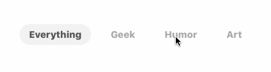
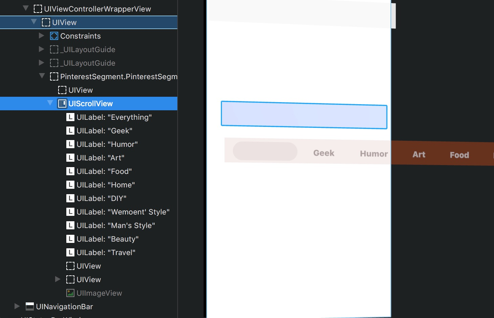

# 写 PinterestSegement 中发现的一个问题
> 2016-12-08 01:23:00

---


最近仿写了一个 PinterestSegement 控件, 效果如下



项目地址: [https://github.com/TBXark/PinterestSegment](https://github.com/TBXark/PinterestSegment)

控件本身实现很简单, 很快就写完了, 但是有人跟我反应所有bug, segment 里面 scrollview 有 偏移导致按钮看不见了




然后 我复现了这个问题(在 demo 的 vc 加上 navigation controller ), 发现是 `automaticallyAdjustsScrollViewInsets` 的锅, 恩没错, 很多 scrollview 的偏移问题都是 `automaticallyAdjustsScrollViewInsets` 的锅, 大部分时候把它设置成 false 就没有问题了.

然后我把 `automaticallyAdjustsScrollViewInsets` 设置成 false 果然就解决了, 但是, 这代码太具有侵入性了, 不可能让所有用这个控件的人记住这一点然后并进行设置. 所以我又研究了一下 `automaticallyAdjustsScrollViewInsets` 属性.

发现, 当 `automaticallyAdjustsScrollViewInsets` 为 true 时, 当 viewcontroller.view  的  第一个 subview 为 scrollerview, 或者 这个  subview 的第一个 subview 为 scrollerview (....递归下去, 相当于视图树的最右的叶结点), 会对那个 scrollerview 做 inset 操作.

然后解决方法就出来了, 同时也很白痴

这个是原来的构造函数

```swift

public init(frame: CGRect, segmentStyle: PinterestSegmentStyle, titles: [String]) {
    self.style = segmentStyle
    self.titles = titles
    super.init(frame: frame)
    addSubview(scrollView)
    reloadData()
}
```

这个是修改之后的构造函数

```swift

public init(frame: CGRect, segmentStyle: PinterestSegmentStyle, titles: [String]) {
    self.style = segmentStyle
    self.titles = titles
    super.init(frame: frame)
    addSubview(UIView()) // fix automaticallyAdjustsScrollViewInsets bug
    addSubview(scrollView)
    reloadData()
}
```


没错, 就是这么简单粗暴, 不让 scrollView 是第一个 subview 就没问题了. 加一个 看不到的 view.

ps: 谁有更好的解决办法也可以告诉我

