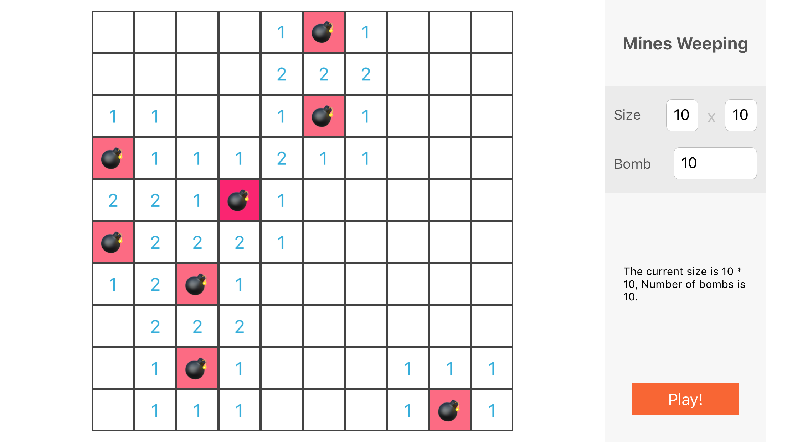

# 简易扫雷游戏
>  2017-01-27 22:20:55

---

在北京回深圳的飞机上太无聊了, 然后顺手写了个扫雷, 但是当时没有写完, 现在顺便用 stroyboard 弄了一个简单配置界面. 之后有机会再完善这个 "游戏" 吧~ 

整个"游戏" 只用了 UIKit, 没有什么高级的组建或者框架.

项目地址 [MinesWeeping](https://github.com/TBXark/MinesWeeping)

**小技巧**

如果你看了我的源代码的话你会发现, 我的构造函数的条用方法都是`ClassName.init(method: abc)` 而不是 `ClassName(method: abc)`,  这是因为xcode 中 swift 的构造函数的自动补全基本是摆设, 但是当你用`.init` 的时候就会出现自动补全, 在我的其他项目中, 我会为了美观再利用万这个自动补全功能后吧`.init` 删掉, 但是这里我就懒得去删除了, 顺便留下这个 tip 给大家.